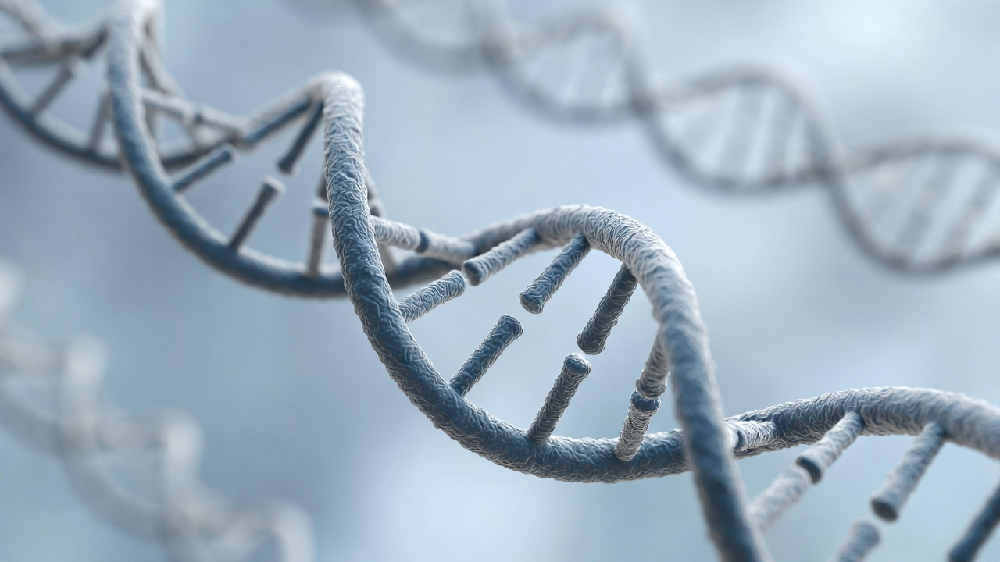

# Day 1: Sloth Case Study and the Question of Evolutionary Evidence

## Objectives

- Describe how scientists investigate evolutionary questions using both historical and modern methods.
- Explain why the pygmy three-toed sloth is used as a Chapter 14 case study.
- Distinguish between data collection and interpretation in scientific explanations.
- Distinguish measurable adaptation and micro-change within populations from broader macro-historical claims.

## Key Terms

- evolution
- evidence
- adaptation
- molecular comparison
- phylogeny

## Textbook Content

- Chapter opener focus: sloth evolution and the pygmy three-toed sloth population on an island off Panama.
- Historical context: early classification and observations (Linnaeus, Darwin) compared with modern molecular methods.
- Figure/case caption: three-toed sloth suspended from a branch, highlighting habitat and trait context used in evolutionary inference.

"Three-toed sloth hanging upside down — Chapter 14 opener"

## In-Class Activities / Minilabs

1. **Bellwork (8 min):** “What counts as strong evidence in science?”
2. **Case Study Analysis (20 min):** Students annotate a short sloth evidence set (location, traits, genetic comparison summary).
3. **Claim-Evidence-Reasoning (25 min):** Teams write one evolutionary interpretation and one common-design interpretation using the same evidence set.
4. **Share and Compare (12 min):** Class compares which interpretation is most directly supported by observed data.
5. **Cross-Case Connection (optional):** Compare sloth evidence with tuskless-elephant trait-frequency change as another adaptation case.

**Sample answers:**
- Strong evidence is measurable, repeatable, and clearly connected to the claim.
- Genetic similarity can support relatedness, but similarity alone does not uniquely prove one historical pathway.

## Critical Perspective

- Which conclusions in the sloth case are directly observed, and which are inferred from models?
- How can the same similarity data be interpreted through common ancestry or common design?
- What methodological assumptions are built into molecular-clock style reasoning?
- Where should scientists use caution when extrapolating from a small island population to broad historical claims?

## Biblical Integration

God’s creation is orderly and knowable, so scientific investigation is worthwhile and good stewardship. Studying variation within populations can deepen gratitude for God’s wisdom in living systems.

<h3>Scripture Connection</h3>

<strong>Colossians 1:16-17</strong>, <strong>Romans 1:20</strong>, and <strong>Genesis 1:31</strong> remind us that creation is purposeful, ordered, and worthy of careful study.

## Homework / Assignment

- Read Chapter 14.1 and complete a two-column chart: “Observed Data” vs. “Interpretive Claim.”
- Write one paragraph explaining the sloth case in your own words using evidence-based reasoning.
- Add brief notes summarizing fossil, anatomical, embryological, molecular, and biogeographical evidence types.

## Exit Ticket / Reflection

What is one piece of evidence from today that is strong, and one claim that still depends on assumptions?

## Teacher Notes Only (not for students)

- Keep discussion academically rigorous: evaluate evidence quality before worldview conclusions.
- Reinforce respectful dialogue and accurate use of scientific vocabulary.

## Navigation

- [← Back to Unit 5 Hub]({{ "/lessons/unit5/" | relative_url }})
- [Go to Day 2 →]({{ "/lessons/unit5/day-02/" | relative_url }})

